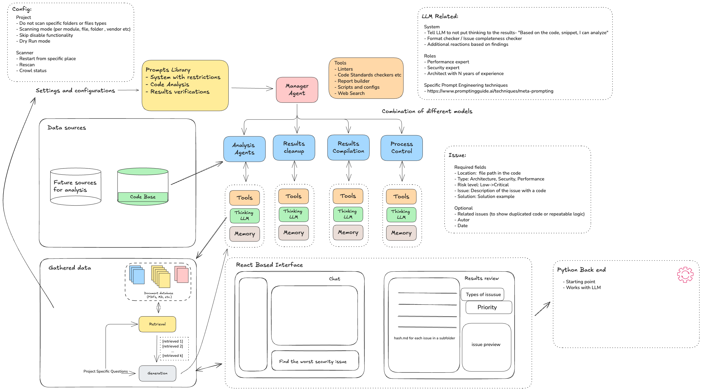

# AI-Powered Code Analysis Multi-Agent System

An intelligent code analysis tool that uses a multi-agent architecture to automatically scan codebases, identify issues across multiple dimensions (security, performance, architecture), and provide actionable recommendations through an interactive interface.



## Features

- **Multi-Agent Analysis**: Three specialized AI agents (Security Expert, Performance Specialist, Architecture Analyst) work collaboratively
- **LangGraph Orchestration**: Manages complex agent workflows with state management and conditional routing
- **Persistent Issue Tracking**: Structured issue storage with markdown reports and JSON indexing
- **Interactive Chat Interface**: Natural language Q&A about discovered issues
- **Real-Time Dashboard**: Live progress and categorized results

## Technology Stack

| Component | Technology |
|-----------|------------|
| Agent Orchestration | LangGraph |
| Agent Framework | LangChain |
| LLM | Ollama (llama3) / OpenAI |
| Backend API | FastAPI |
| Frontend | React + Vite + Tailwind CSS |
| Observability | LangSmith |
| Storage | Local filesystem (Markdown + JSON) |

## Prerequisites

- **Python 3.11+**
- **Conda or Miniconda** - [Install Miniconda](https://docs.conda.io/en/latest/miniconda.html)
- **Node.js 18+** - [Install Node.js](https://nodejs.org/)
- **Git**
- **Ollama** (optional, for local LLM) - [Install Ollama](https://ollama.ai/)
- **OpenAI API Key** (optional, for cloud LLM)

## Quick Start

### 1. Clone the Repository

```bash
git clone <repository-url>
cd code-analysis-multi-agent
```

### 2. Set Up Python Environment

```bash
# Create conda environment
conda env create -f environment.yml

# Activate environment
conda activate code-analyzer

# Verify installation
python -c "import langchain, langgraph, fastapi; print('All imports OK!')"
```

### 3. Set Up Frontend

```bash
cd frontend
npm install
cd ..
```

### 4. Configure Environment

```bash
# Copy example environment file
cp .env.example .env

# Edit .env with your settings
# Required: Set either OPENAI_API_KEY or ensure Ollama is running
```

### 5. (Optional) Start Ollama

If using local LLM:

```bash
# Start Ollama service
ollama serve

# Pull the model (in another terminal)
ollama pull llama3
```

### 6. Start the Application

**Backend:**
```bash
cd backend
uvicorn app:app --reload --host 0.0.0.0 --port 8000
```

**Frontend (in another terminal):**
```bash
cd frontend
npm run dev
```

Visit `http://localhost:5173` to access the application.

## Project Structure

```
code-analysis-multi-agent/
├── backend/
│   ├── agents/          # Multi-agent system components
│   │   ├── graph.py     # LangGraph workflow definition
│   │   ├── manager.py   # Manager agent
│   │   ├── specialists.py # Security, Performance, Architecture agents
│   │   └── compiler.py  # Results compiler
│   ├── tools/           # LangChain tools for code analysis
│   │   └── code_tools.py
│   ├── models/          # Data models and schemas
│   │   └── issue.py     # Issue model and IssueStore
│   ├── prompts/         # Prompt templates
│   │   └── templates.py
│   ├── tests/           # Test suites
│   ├── app.py           # FastAPI application
│   └── config.py        # Configuration
├── frontend/
│   ├── src/
│   │   ├── components/  # React components
│   │   │   ├── AnalysisDashboard.jsx
│   │   │   ├── IssuesList.jsx
│   │   │   └── ChatPanel.jsx
│   │   ├── api/         # API client
│   │   └── App.jsx      # Main application
│   ├── package.json
│   └── tailwind.config.js
├── issues/              # Generated issue reports
├── environment.yml      # Python dependencies
├── .env.example         # Environment template
└── README.md
```

## API Endpoints

| Method | Endpoint | Description |
|--------|----------|-------------|
| GET | `/health` | Health check |
| POST | `/analyze` | Start code analysis |
| GET | `/issues` | List all issues (with filters) |
| GET | `/issues/{id}` | Get issue details |
| POST | `/chat` | Chat about issues |

## Usage

### Running Analysis

1. Open the dashboard at `http://localhost:5173`
2. Enter the path to your codebase
3. Click "Start Analysis"
4. View results categorized by Security, Performance, and Architecture

### Browsing Issues

1. Navigate to the "Issues" tab
2. Filter by type (Security, Performance, Architecture)
3. Filter by risk level (Critical, High, Medium, Low)
4. Click an issue to view details and recommendations

### Chat Interface

1. Navigate to the "Chat" tab
2. Ask questions like:
   - "What are the most critical issues?"
   - "How do I fix the SQL injection vulnerability?"
   - "Summarize the performance problems"

## Development

### Running Tests

```bash
# Backend tests
cd backend
python -m pytest -v

# With coverage
python -m pytest --cov=. --cov-report=html
```

### Code Quality

```bash
# Lint Python code
ruff check backend/

# Format Python code
ruff format backend/
```

## Configuration

Key environment variables:

| Variable | Description | Default |
|----------|-------------|---------|
| `OPENAI_API_KEY` | OpenAI API key | - |
| `OLLAMA_BASE_URL` | Ollama server URL | `http://localhost:11434` |
| `OLLAMA_MODEL` | Ollama model name | `llama3` |
| `LANGCHAIN_API_KEY` | LangSmith API key | - |
| `ISSUES_DIR` | Issue storage directory | `./issues` |

## Troubleshooting

### Common Issues

**"Module not found" errors:**
```bash
conda activate code-analyzer
pip install -e .
```

**Ollama connection refused:**
```bash
# Ensure Ollama is running
ollama serve
```

**CORS errors in browser:**
- Verify `FRONTEND_URL` in `.env` matches your frontend URL
- Check that backend CORS middleware is configured correctly

**Slow analysis:**
- Local LLM (Ollama) may be slower than OpenAI
- Consider using OpenAI for faster results

## License

See [LICENSE](LICENSE) file.

## Contributing

1. Fork the repository
2. Create a feature branch
3. Make your changes
4. Run tests
5. Submit a pull request

